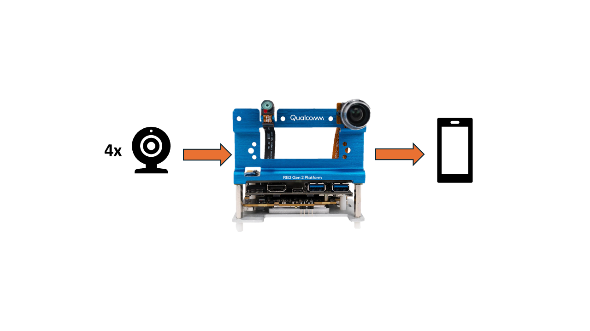

# Qualcomm-RB3-Gen2-Smart-Security

## Advantages of IQ9075

1. RB3 Gen2 can provide up to 12 TOPS of AI computing power and supports GPU and DSP accelerated computing
2. The Qualcomm Neural Processing (SNPE) SDK and the Qualcomm AI Engine Direct (QNN)can optimize the performance of trained neural networks
3. It supports Yocto, Ubuntu, Android, and Windows for AI development

## Performance Metrics

- **AI Model**:
- 圖文多模態 (Vision-Language)：MobileCLIP-S2

## Hardware

- **Platform**: Qualcomm QCS6490 (Dragonwing RB3 Gen 2)
- **Cameras**:  4 × USB cameras (2 × USB 3.0 ports, 2 × Type-C via USB Hub)
- **Connectivity**:  Wi-Fi + Bluetooth Low Energy (BLE)

## Software & Toolkit

- **AI SDK (SNPE) SDK**： v2.16.0.231029
- **System:** Qualcomm Linux / Yocto (BSP: qcom-linux-scarthgap, QLI.1.5)

## Background & Solution

### Motivation

The CLIP (Contrastive Language–Image Pre-training) model combines visual and textual semantic alignment, enabling scene understanding and recognition through semantics. Compared to traditional security systems that only detect objects, it offers greater flexibility and intelligence

### Solution

By using an AI vision-language model for on-device image analysis, surveillance footage is converted into concrete textual descriptions, helping users understand abnormal situations while enhancing data privacy and security

## Architecture Diagram

QCS6490 Smart Security is a multi-camera surveillance system integrated with the OpenAI CLIP vision-language model
The cameras capture images that are analyzed by the QCS6490
Users can view live surveillance footage and AI analysis results on their mobile devices via WiFi

## Demo

https://github.com/user-attachments/assets/cc5d0cd2-8ef3-4783-a92a-27033982618c

https://github.com/user-attachments/assets/23677436-2632-41a4-a90b-7a4c1a94bc46

https://github.com/user-attachments/assets/93e2d5f6-5d72-4281-ba24-07ed9cf1103b
